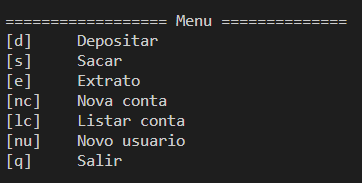

# Simple bank system

This is a simple "toy" project for the course **Formação Python Developer**.  
The objective of this course is to practice with fundamentals topics of Python.  
This is the first project, the easier one, in the next projects will be used functions and other more "advanced" python elements.  

